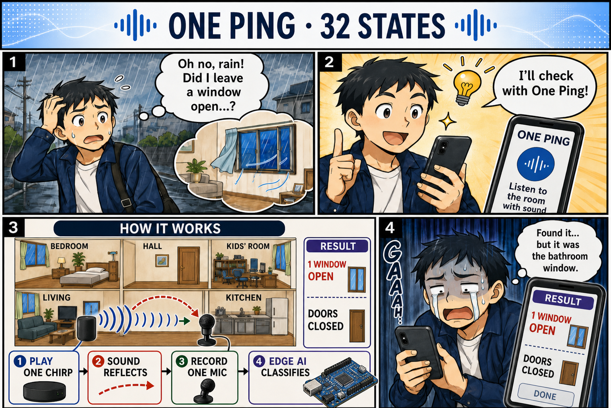

# UNO Ping

**One speaker, one microphone, every window and door.** UNO Ping plays a 2-second noise "ping" into a home and classifies which of five windows and doors are open from the way the rooms filter that sound. This repository is the **Arduino UNO Q** port: real-time I/O on the STM32U585, audio and a 1D CNN on the Qualcomm QRB2210 Linux side, all in one Arduino App Lab app.



- Contest article (Hackster, Home Automation): [docs/hackster/story_en.md](docs/hackster/story_en.md) — Japanese review copy: [docs/hackster/story_ja.md](docs/hackster/story_ja.md)
- Documentation site (GitHub Pages): https://airpocket-soundman.github.io/IchiPing-UNO-Q/

## Results at a glance

Held-out UNO Q evaluation sets, 32-state / 14-class (observable) accuracy:

| Evaluation set | Condition | 32-state | 14-class |
|---|---|---|---|
| 09:00 | stable | 91.7 % | 100 % |
| 19:35 | temperature drift (−2.15 % frequency warp) | 81.9 % | 100 % |
| 20:44 | drift −1.05 % | 74.7 % | 100 % |
| 21:28 | crowd noise playing | 81.9 % | 100 % |

The original FRDM-MCXN947 model scored 20.8 % on the same hardware; real UNO Q sessions, cross-baseline training, ambient noise and a new temperature (frequency-warp) augmentation took it to 82.5 % mean, while the observable classes stay at 100 %.

## Documentation

| Page | Contents |
|---|---|
| [Hardware and wiring](docs/uno_q/hardware.md) | BOM, MCU pins, 1.8 V MI2S0 audio wiring, safety rules |
| [Software architecture](docs/uno_q/software.md) | App Lab app, Bridge services, audio worker, TFT rendering |
| [Acoustic sensing and model](docs/uno_q/signal_and_model.md) | PRBS excitation, features, model, observability |
| [Data collection and training](docs/uno_q/data_and_training.md) | automated collection, sessions, training recipe, temperature augmentation |
| [Results](docs/uno_q/results.md) | accuracy on held-out sets, beyond the observable region, resources |
| [Reproduce](docs/uno_q/reproduce.md) | step-by-step build, deploy and training guide |
| [Model comparison](pc/runs/model_comparison_20260912.md) | all 23 trained models with their augmentation |
| [Shield PCB design](hardware/easyeda/IchiPing-UNO-Q-Shields/SPECIFICATION.md) | EasyEDA audio and TFT shields, BOMs, pin maps |

## Repository layout

| Path | Contents |
|---|---|
| `uno_q/app/` | Arduino App Lab app: `sketch/` (STM32U585), `python/` (Linux runtime), `models/` (deployed ONNX + manifest) |
| `uno_q/audio/` | MI2S0 Device Tree overlay, ALSA route and safe capture tools, audio worker, offline tests |
| `pc/uno_q_*.py` | data collection, dataset export, evaluation and comparison tools |
| `pc/training/` | dataset loader, augmentation (incl. `--freq-warp`), training script |
| `docs/uno_q/` | documentation (Markdown sources; HTML is generated by `tools/build_site.py`) |
| `hardware/easyeda/`, `board/` | UNO Q shield PCB design (EasyEDA Pro) |
| `firmware/`, `hardware/`, other `docs/*.html` | reference material from the original FRDM-MCXN947 UNO Ping project |

The original project lives at https://github.com/airpocket-soundman/IchiPing.

## Tests

```bash
python -m unittest discover -s uno_q/app/python -p "test_*.py"
python -m unittest discover -s uno_q/audio -p "test_*.py"
```

## License

Inherits the license conditions of the original IchiPing project. Code derived from Arduino examples follows the license of each file.

---

日本語の概要：1つのスピーカーと1つのマイクで、住まいの5か所の窓・扉の開閉を音で推定するプロジェクト UNO Ping です（IchiPing の Arduino UNO Q 移植版）。記事の日本語確認版は [docs/hackster/story_ja.md](docs/hackster/story_ja.md) にあります。
