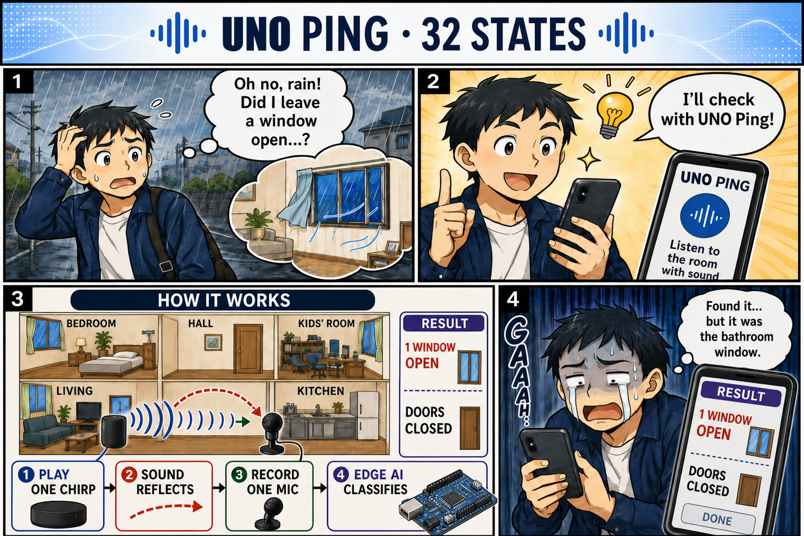
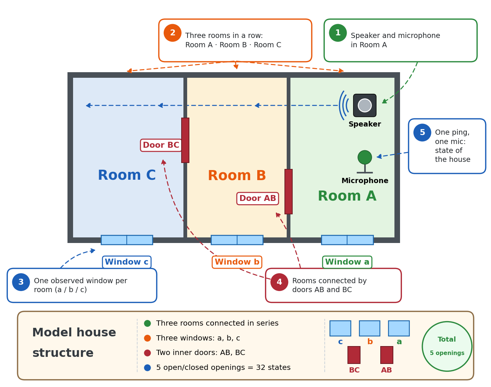
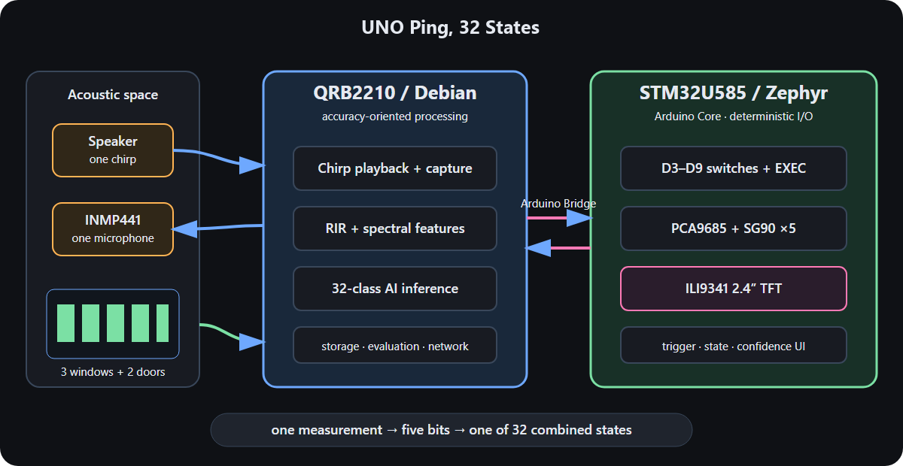
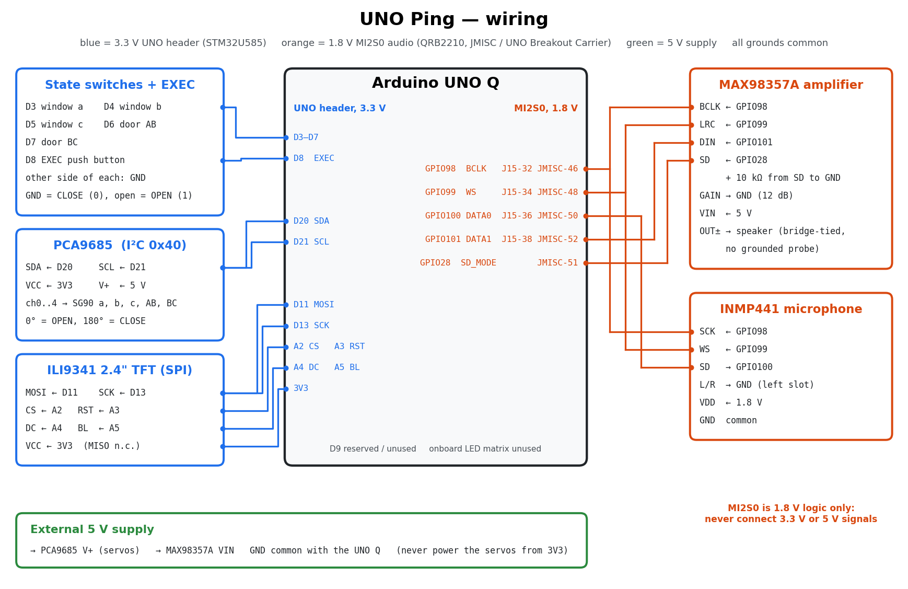
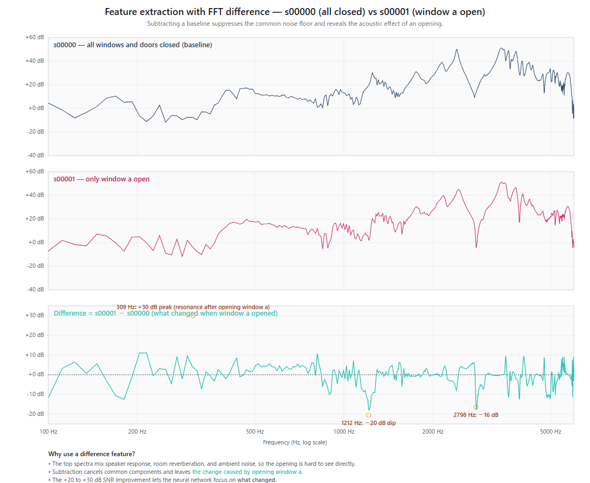
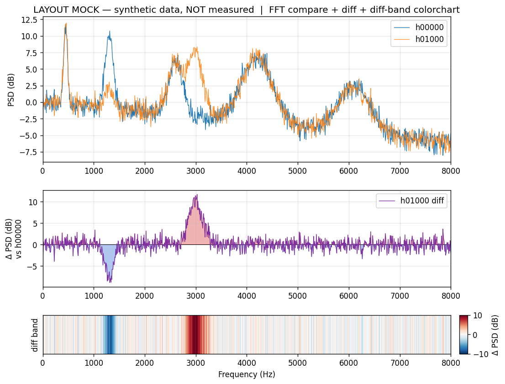
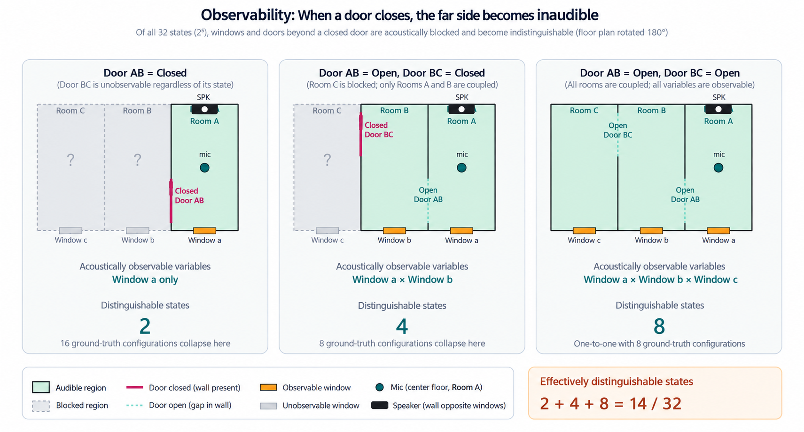
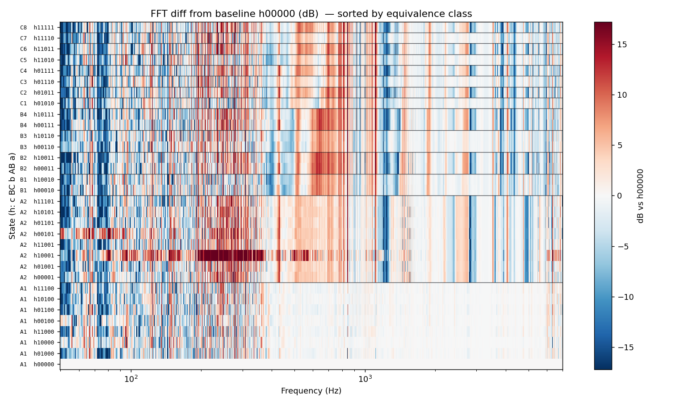

# UNO Ping — One Speaker, One Microphone, Every Window and Door

**Category:** Home Automation

**Short description:** One speaker and one microphone on an Arduino UNO Q "ping" a home with a 2-second noise burst; a tiny neural network on the Linux side tells which of five windows and doors are open — and learns to hear even the rooms it cannot directly reach.

**Code:** https://github.com/airpocket-soundman/IchiPing-UNO-Q — **Docs:** https://airpocket-soundman.github.io/IchiPing-UNO-Q/

[PHOTO: COVER IMAGE — the model apartment with the UNO Q, the TFT showing a result, and the servos on the windows and doors]

## 1. "Did I leave a window open?"

You are on the train when the rain starts, and you wonder whether a window is still open. Or you notice the air conditioner has been cooling the house all afternoon with a window wide open. The usual fix is a contact sensor on every window and door: one sensor, one battery and one pairing per opening.

UNO Ping asks a different question: **can the home itself be the sensor?** A speaker plays a short, known noise signal. Every open or closed window and door changes how the rooms filter that sound. One microphone records it, and a small neural network reads the state of all openings at once.

> "UNO" means "one": one speaker, one microphone, one ping — on one Arduino UNO Q. The name continues the original project, IchiPing ("ichi" is Japanese for "one").

## 2. What it does

- Recognises all **32 combinations** of five openings in a model apartment: windows **a, b, c** and inner doors **AB, BC**.
- One 2-second PRBS excitation per measurement; the TFT shows the answer about 5 seconds after pressing EXEC.
- Runs entirely on the Arduino UNO Q: no cloud and no PC at inference time.
- Knows its limits: it separates what is **acoustically observable** from what is only faintly audible (Section 6).

### The model house

The test bed is a model house with three rooms in a row, **C | B | A**:

- **Room A** holds the only speaker and the only microphone.
- Each room has one observed window: **a**, **b** and **c**.
- Two inner doors connect the rooms: **AB** between A and B, **BC** between B and C.
- These five openings, each open or closed, give **2⁵ = 32 states**. A servo moves each opening, so the rig can reproduce any state automatically.

Sound from room A reaches room C only through both doors. This series layout is what makes the problem interesting: a closed door AB acoustically hides everything behind it (Section 6).

[PHOTO: the physical model apartment from above, with labels a, b, c, AB, BC]
[VIDEO: 30–60 s demo — flip a switch, the servo opens a window, press EXEC, the TFT shows "Complete Success"]

## 3. Why the Arduino UNO Q: two brains in one App Lab app

UNO Ping grew out of IchiPing, which started on an NXP FRDM-MCXN947. Moving it to the UNO Q put each half of the problem where it fits best:

| Brain | Code | Job |
|---|---|---|
| **STM32U585 MCU** (Zephyr, Arduino sketch) | `uno_q/app/sketch/` | switches and EXEC button, PCA9685 servo driver (5 × SG90), ILI9341 TFT |
| **Qualcomm QRB2210 MPU** (Debian, App Lab Python) | `uno_q/app/python/` | MI2S0 audio (MAX98357A + INMP441), signal processing, ONNX Runtime inference, baseline storage |
| **Arduino Router Bridge** | RPC between both | `on_infer_request`, `show_prediction`, `set_servo_armed`, `move_servo_deg`, … |

Sketch, Python runtime and model ship together as one **App Lab app**. A small host-side worker owns the ALSA routes and the amplifier shutdown pin, so the containerised app never touches the audio hardware directly and every stop path is verified. The model needs only **1.7 ms (p95)** on the Cortex-A53; the 2-second acoustic ping dominates the latency.

## 4. Hardware

### Bill of materials

| Qty | Part | Notes |
|---|---|---|
| 1 | Arduino UNO Q (4 GB) | QRB2210 MPU + STM32U585 MCU |
| 1 | UNO Breakout Carrier (JMISC access) | 1.8 V MI2S0 audio pins |
| 1 | INMP441 I²S MEMS microphone | DATA0, L/R = GND, VDD = 1.8 V |
| 1 | MAX98357A I²S amplifier + small speaker | DATA1, GAIN = GND, SD = SoC GPIO 28 + 10 kΩ to GND |
| 1 | PCA9685 PWM driver | I²C 0x40 (D20/D21) |
| 5 | SG90 micro servos | windows a, b, c and doors AB, BC |
| 1 | ILI9341 2.4" SPI TFT | D11, D13, A2–A5 |
| 5 + 1 | toggle switches + push button | D3–D7 and EXEC on D8 |
| 1 | 5 V supply | servos and amplifier, common GND |
| 1 | model apartment | three rooms, three windows, two doors |

Software: Arduino App Lab, Arduino Router Bridge, Debian ALSA, Python 3 with NumPy and ONNX Runtime; PyTorch on a PC for training.

### Schematics and wiring

| Signal | UNO Q | Device |
|---|---|---|
| BCLK / WS | SoC GPIO 98 / 99 | MAX98357A BCLK/LRC, INMP441 SCK/WS |
| Mic data | SoC GPIO 100 (DATA0) | INMP441 SD |
| Amp data | SoC GPIO 101 (DATA1) | MAX98357A DIN |
| Amp shutdown | SoC GPIO 28 | MAX98357A SD (10 kΩ to GND) |
| I²C | D20 / D21 | PCA9685 |
| SPI TFT | D11, D13, A2 CS, A3 RST, A4 DC, A5 BL | ILI9341 |
| Inputs | D3–D7, D8 | switches, EXEC |

The pin-level wiring diagram is on the documentation site (`docs/gpio_wiring.html`). Two UNO Q shields (audio and TFT) were designed in EasyEDA Pro; the project file, BOMs and pin maps are attached.

> **A note on the shield boards.** As an experiment, the shields were designed by an AI assistant. Their schematic drawings are not very tidy or easy to read, but the circuits are electrically correct: the boards were manufactured, assembled and run the whole system shown here.

[PHOTO: wiring close-up — UNO Q, Breakout Carrier, PCA9685, TFT, microphone and amplifier]

## 5. How the acoustic sensing works

1. **Excite.** The speaker plays a 2.0 s ±1 PRBS, band-limited to 8 kHz.
2. **Record.** The INMP441 records 3 s at 48 kHz with 24-bit resolution; the frame is aligned to the PRBS onset by cross-correlation and decimated to 16 kHz.
3. **Compare.** A 1024-bin log-power spectrum minus the **all-closed baseline** recorded on the device, normalised per frame.
4. **Classify.** A 104k-parameter CNN outputs one of 32 states.

**Why learn the difference to the baseline.** The raw spectra of two states look almost the same, because the room's own resonances and the speaker and microphone responses dominate them. Subtracting the all-closed baseline cancels everything that does not change, so only the effect of the opening is left. The network learns that change directly, as a strong and clean feature, instead of searching for it inside a large fixed spectrum.

**How to read a 1-D heatmap.** The bottom strip ("diff band") shows the same difference as colour: each vertical line is one frequency bin, red is louder than the baseline, blue is quieter and white is unchanged. The mock-up below uses synthetic data so the pattern is easy to see; real measurements show the same kind of stripes, only smaller and more numerous. Stacking one strip per state gives the class map in Section 8.

**A porting detail that mattered.** The original model scored only 20.8 % on the UNO Q at first. The original firmware converted each I²S word with `>> 12`; ALSA 16-bit capture corresponds to `>> 16`. Reproducing the original scale exactly (×16 from the 24-bit capture) plus the original PRBS level matched the original dataset's recording energy within 0.02 dB. Without it, 39 % of the spectrum bins sat on the −80 dB floor.

## 6. The observability concept

One microphone in room A cannot hear every opening equally. With door **AB** closed, the rooms behind it are acoustically shadowed: opening window b or c changes the sound at the microphone only a little. UNO Ping therefore groups the 32 states into **14 observable classes**:

- **A1 / A2** — door AB closed: only window a is observable.
- **B1–B4** — AB open, BC closed: a, b and AB observable; c hidden.
- **C1–C8** — AB and BC open: all five observable.

The figure shows the three cases. With door AB closed only window a can be heard, so the 16 configurations of b, c and BC collapse into 2 distinguishable states. With AB open and BC closed, windows a and b are audible and 8 configurations collapse into 4. With both doors open all rooms are coupled and each of the 8 configurations is distinguishable: 2 + 4 + 8 = **14 observable classes** out of 32 states.

The TFT colours each digit as observable (bright) or hidden (dark) and shows **Complete Success** (blue, all 32-state bits right), **Conditional Success** (green, the observable part right) or **Failure** (red). The user always knows what the system guarantees and what is a best guess.

[PHOTO: TFT showing the inf/act rows with the green "Conditional Success" or blue "Complete Success" banner]

## 7. Collecting real data on the UNO Q — automatically

The App Lab app accepts evaluation commands, so a PC commands the servos over Wi-Fi while the UNO Q plays and records:

- **Gray-code order:** each step moves exactly one servo (106 moves instead of 242).
- **Fixed settle:** capture starts exactly 0.5 s after the last servo stops.
- **Batched frames:** 50 frames per state are one continuous PCM and one continuous capture, split offline at the exact pitch (0-sample error): 2.3 s per frame.
- **No sudo, no board storage:** the audio tools run as a normal user in the `audio` and `gpiod` groups; captures are deleted from the board once copied.

In one day the rig recorded **8 sessions × 1,650 frames**, two ambient recordings (room noise and crowd noise) and four evaluation sessions.

## 8. Hearing what the microphone can barely hear

The result we are most proud of: with enough real data and the right augmentations, the model learned the tiny acoustic cues **outside the observable region** as well — the windows behind a closed door.

1. **More sessions.** Accuracy on an unseen session rose from 47 % (1 session) to 94 % (5 sessions).
2. **The original recipe.** Strong augmentation and **cross-baseline** training: each recording is also expressed against every other session's baseline, so the model stops depending on one reference.
3. **Real ambient noise.** Room noise and crowd noise recorded through the same microphone, mixed in at 0–35 dB SNR.
4. **Temperature augmentation (new).** In the evening every model got worse. The cause was the room itself: as the air conditioner cooled it, all resonances shifted by up to **−2.15 %** (the speed of sound changes by about 0.18 %/°C). Warping the sample spectrum by a random ±3 % *before* subtracting the baseline teaches the model this effect.

**What the model sees.** The map below stacks the difference-to-baseline strips of all 32 states, sorted by the 14 observable classes (A1 … C8; after the `h`, the bits are c BC b AB a). Between classes the stripe patterns differ clearly — for example, the B rows share a strong red band near 650 Hz that the A rows lack — so the 14-class task is easy. Inside a class the rows look almost identical: the eight A1 rows differ only in the hidden windows b and c and door BC. Telling those apart is the hard 32-class task. Even so, with more sessions and the augmentations above, the model learned these faint differences well enough to reach 82.5 % on all 32 states.

| Model | 09:00 stable | 19:35 (−2.15 % drift) | 20:44 | 21:28 + crowd noise | Mean 32-state |
|---|---|---|---|---|---|
| Original FRDM model | 20.8 / 59.4 | 35.9 / 68.8 | 9.1 / 49.7 | 11.6 / 50.0 | 19.3 |
| UNO Q, 4 sessions | 86.5 / 100 | 43.1 / 84.1 | 69.1 / 99.7 | 76.9 / 100 | 68.9 |
| + frequency warp | 89.6 / 100 | 56.9 / 93.8 | 82.8 / 100 | 80.9 / 100 | 77.6 |
| **8 sessions + warp + ambient (deployed)** | **91.7 / 100** | **81.9 / 100** | **74.7 / 100** | **81.9 / 100** | **82.5** |

*(32-state / 14-class accuracy in %, held-out evaluation sessions.)*

- The **observable 14-class accuracy is 100 %** on every set — through crowd noise and a 2 % temperature shift.
- The **32-state accuracy**, which needs the hidden windows, rose from 20.8 % to **82.5 %**. Window c behind closed doors — a cue of only 0.5–0.9 dB — went from 56 % to 86–90 %.

## 9. A flicker-free TFT

The first UI repainted the whole 320 × 240 screen on every update. Now the static frame is drawn once, only changed digits are redrawn, and each digit and the status banner are generated as a **procedural sprite** streamed through one SPI window — no visible intermediate frame and no 150 kB frame buffer on the MCU.

## 10. Build it yourself

1. Build the model apartment and wire the parts (Section 4).
2. Enable the MI2S0 audio bus once (Device Tree overlay and ALSA modules, `uno_q/audio/README.md`).
3. Deploy the App Lab app from `uno_q/app/`, make it the default app (`arduino-app-cli properties set default user:ichiping-uno-q`) and start the audio worker at boot (`uno_q/audio/start-runtime-worker.sh` as a user `@reboot` cron job).
4. Power on. The app closes every servo, records a fresh all-closed baseline and then lets the servos follow the switches — no PC needed.
5. Flip switches, press EXEC, read the TFT.
6. Train your own floor plan: `pc/uno_q_collect.py` → `pc/uno_q_export_dataset.py` → `pc/training/train_32cls.py --baseline-jitter-dirs … --ambient-dirs … --freq-warp 0.03` → `pc/uno_q_evaluate_all.py`.

The step-by-step guide is on the documentation site.

## 11. Sustainability, user experience and scalability

- **Sustainability:** one sensor node instead of one per opening, and a way to catch "window open while the air conditioner runs" before energy is wasted.
- **User experience:** nothing to stick on the windows; a clear on-screen answer with an honest observable / hidden indication.
- **Scalability:** collection, export, training and evaluation are scripted, so the same pipeline retrains for another floor plan; App Lab keeps sketch, Python and model in one deployable app.

## 12. What's next

- Sessions across several days and air-conditioner settings, with on-device temperature logging.
- A web UI Brick to check the home from a phone.
- A quantised model for the MCU/NPU path.

---

*Built with Arduino UNO Q, Arduino App Lab, ONNX Runtime and PyTorch. Full code and documentation: https://github.com/airpocket-soundman/IchiPing-UNO-Q*
