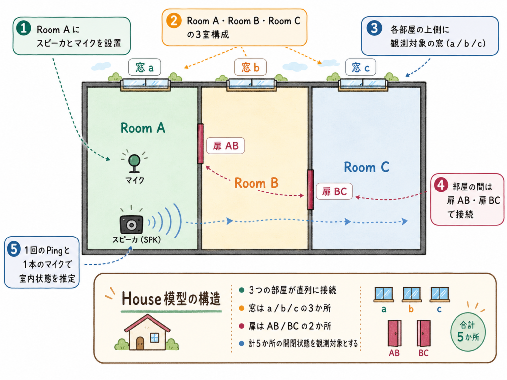

# Hardware and wiring

IchiPing UNO Q uses one speaker and one microphone to classify five openings of a model apartment. The UNO Q MCU drives the switches, servos and TFT; the Linux side drives the audio bus.

## Bill of materials

| Qty | Part | Role / notes |
|---|---|---|
| 1 | Arduino UNO Q (4 GB) | Qualcomm QRB2210 MPU (Debian) + STM32U585 MCU (Zephyr) |
| 1 | UNO Breakout Carrier (or JMISC access) | exposes the 1.8 V MI2S0 audio pins, which are not on the UNO header |
| 1 | INMP441 I²S MEMS microphone | MI2S0 DATA0, L/R = GND, VDD = 1.8 V |
| 1 | MAX98357A I²S class-D amplifier | MI2S0 DATA1, GAIN = GND (12 dB), VIN = 5 V, SD = SoC GPIO 28 |
| 1 | Small speaker (4–8 Ω) | driven by the MAX98357A (bridge-tied output) |
| 1 | 10 kΩ resistor | MAX98357A SD to GND (keeps the amplifier off when GPIO 28 is not driven) |
| 1 | PCA9685 16-channel PWM driver | I²C address 0x40 |
| 5 | SG90 micro servos | open/close window a, b, c and door AB, BC |
| 1 | ILI9341 2.4" SPI TFT, 320 × 240 | inference / actual state display |
| 5 | Toggle switches | requested state of each opening (to GND) |
| 1 | Push button | EXEC (start one inference) |
| 1 | 5 V supply for servos and amplifier | common GND with the UNO Q |
| 1 | Model apartment | three rooms in a row, three windows, two inner doors |

## MCU side (UNO header, 3.3 V)

| UNO Q pin | Connection | Notes |
|---|---|---|
| D3 / D4 / D5 / D6 / D7 | switches for window a, b, c, door AB, BC | `INPUT_PULLUP`; GND = CLOSE (0), open = OPEN (1) |
| D8 | EXEC push button to GND | Low = pressed |
| D20 / SDA, D21 / SCL | PCA9685 SDA / SCL | address 0x40; channels 0–4 = a, b, c, AB, BC |
| D11 (MOSI), D13 (SCK) | ILI9341 SPI | write-only, D12/MISO not connected |
| A2 / A3 / A4 / A5 | ILI9341 CS / RST / DC / BL | same wiring as the original IchiPing shield |
| 3V3 | ILI9341 VCC, PCA9685 VCC | logic only — never power servos from 3V3 |

Servo angles: 0° (PCA9685 tick 102) = OPEN, 180° (tick 553) = CLOSE. Servo power comes from the external 5 V rail; all grounds are common.

The pin-level wiring diagram (switches, EXEC, PCA9685, TFT and the 5 V rail) is in [gpio_wiring.html](../gpio_wiring.html).

[PHOTO: wiring close-up — UNO Q with the Breakout Carrier, PCA9685, TFT and the audio boards]

## Linux side (MI2S0 audio, 1.8 V)

The QRB2210 primary MI2S bus runs at 48 kHz, stereo, 32-bit slots (24 significant bits). It is reached through JMISC or the UNO Breakout Carrier.

| Signal | SoC GPIO | Device pin |
|---|---:|---|
| BCLK / SCK | 98 | MAX98357A BCLK, INMP441 SCK |
| WS / LRC | 99 | MAX98357A LRC, INMP441 WS |
| DATA0 (capture) | 100 | INMP441 SD |
| DATA1 (playback) | 101 | MAX98357A DIN |
| Amplifier shutdown | 28 | MAX98357A SD, with 10 kΩ to GND |

Safety rules used throughout the project:

- MI2S0 is a 1.8 V interface: never connect 3.3 V or 5 V signals to it.
- Power the microphone and amplifier before connecting their signal lines; change wiring only with power off.
- The MAX98357A output is bridge-tied: never connect a grounded probe to OUT+/OUT−.

The audio bus needs a Device Tree overlay and ALSA routing on the Linux side; see [Software architecture](software.md) and `uno_q/audio/README.md`.
