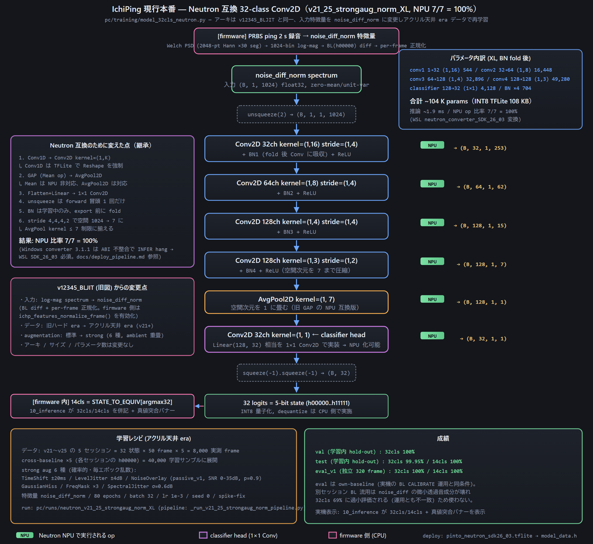
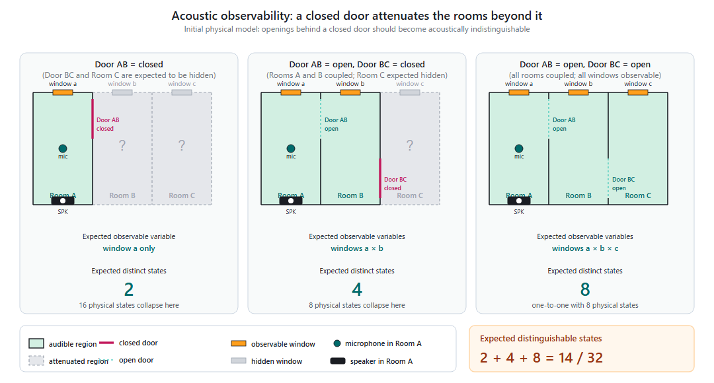

# Acoustic sensing and model

## Idea

A known sound is played into the apartment. The rooms, windows and doors filter it; opening any of them changes the transfer function between the speaker and the microphone. Comparing the recorded spectrum with an all-closed reference reveals which openings changed.

## Excitation and capture

| Step | Setting |
|---|---|
| Excitation | ±1 PRBS, 16 kHz source band-limited to 8 kHz, 2.0 s, amplitude ±0.0088 FS (original collector: 30000 × 3 % × 30 %) |
| PCM | 0.5 s silence + 2.0 s PRBS + 1.0 s silence, 48 kHz S32_LE stereo |
| Capture | INMP441, 3 s, 48 kHz S32_LE (24 significant bits) |
| Alignment | cross-correlation with the known PRBS, 2.0 s frame from the onset |
| Scale | decimate to 16 kHz, ×16 (= the original firmware's `word >> 12`) |

The ×16 scale is required, not cosmetic: the spectrum is clamped at −80 dB before normalisation, and without it 39 % of the bins would sit on that floor.

## Features

`noise_diff_norm`: Welch log-power spectrum (Hann 2048, 50 % overlap, 1024 bins, −80 dB floor), minus the all-closed baseline, then zero-mean / unit-variance per frame. Absolute level drops out; the model sees the *shape* of the change.

## Model

IchiPingV1_32clsNeutron-XL: a Conv2D/1D-style network designed for the MCXN947 Neutron NPU in the original project, 104k parameters, input `(1, 1, 1, 1024)`, 32 logits (state index = a + 2b + 4c + 8AB + 16BC). On the UNO Q it runs in FP32 with ONNX Runtime: 1.7 ms p95 warm latency, about 62 MiB RSS.

## Observability

A single microphone in room A cannot hear every opening equally. When door AB is closed, the rooms behind it are acoustically shadowed. The project groups the 32 states into **14 observable classes**:

| Group | Condition | Observable openings |
|---|---|---|
| A1, A2 | door AB closed | window a (b, c, BC hidden) |
| B1–B4 | AB open, BC closed | a, b, AB (c hidden) |
| C1–C8 | AB and BC open | all five |

The TFT colours each digit by observability and reports Complete Success (all 32-state bits), Conditional Success (observable part) or Failure. See [Results](results.md) for how far the model goes beyond the observable region.
