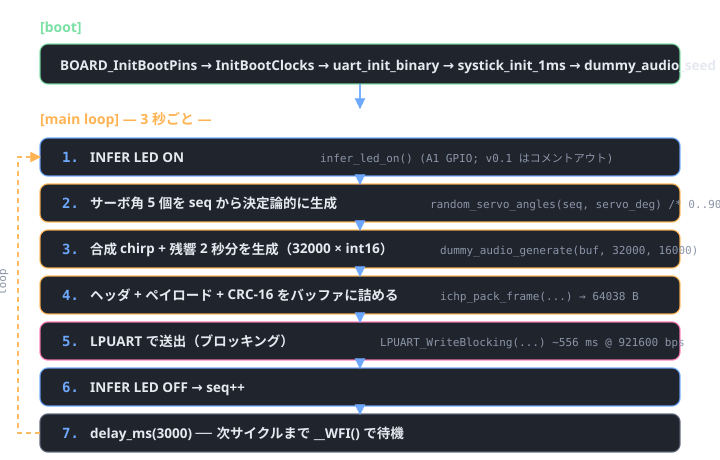
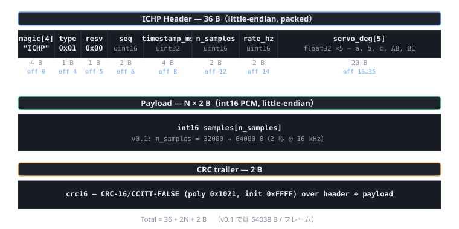

# IchiPing firmware

MCUXpresso 用の最小スケルトン。**まだ実ハード（INMP441 マイク / MAX98357A / PCA9685 など）には触らず**、合成 chirp + 残響テールを生成して OpenSDA デバッグ UART に流すだけ。PC 側 ([../pc/receiver.py](../pc/receiver.py)) と組み合わせて、シリアル経路と保存パイプラインを先に通すための足場。

## 構成

各 MCUXpresso プロジェクトは `projects/XX_*/` ディレクトリに分かれ、共通ドライバ・ヘッダは `shared/` に集約。プロジェクト側は `shared/include` を Include パスに、必要な `shared/source/*.c` をビルドに含める形で構成する。

```
firmware/
├── shared/                              プロジェクト共通の C コード
│   ├── include/
│   │   ├── ichiping_frame.h              フレーム形式（PC 側と共有する単一の真実）
│   │   ├── dummy_audio.h                 合成 chirp + 残響ジェネレータ
│   │   ├── servo_driver.h                共通サーボ API（PCA9685 / LU9685 切替）
│   │   ├── pca9685.h                     PCA9685 ネイティブ API（16ch, NXP）
│   │   ├── lu9685.h                      LU9685 ネイティブ API（20ch, 互換品）
│   │   ├── ili9341.h                     ILI9341 240×320 RGB565 TFT API
│   │   └── lv_port.h                     LVGL ポート公開関数
│   └── source/
│       ├── ichiping_frame.c              ヘッダ + CRC-16/CCITT パッカー
│       ├── dummy_audio.c                 合成 chirp 200→8 kHz + 残響
│       ├── pca9685.c                     PCA9685 ドライバ（PWM tick burst write）
│       ├── lu9685.c                      LU9685 ドライバ（角度バイト + bulk update）
│       ├── ili9341.c                     ILI9341 ドライバ（SPI + 5x7 ASCII フォント）
│       └── lv_port_disp.c                LVGL ↔ ILI9341 glue（partial render）
├── projects/                            MCUXpresso プロジェクトを 1 つずつ独立に
│   ├── 01_dummy_emitter/                 シリアル疎通／フレーム生成（LPUART のみ）
│   │   ├── main.c
│   │   ├── README.md
│   │   ├── CMakeLists.txt                プロジェクト固有のソース＋インクルードリスト
│   │   ├── CMakePresets.json             debug/release プリセット（共通）
│   │   ├── Kconfig                       SDK Kconfig ルート（共通）
│   │   ├── example.yml                   MCUXpresso example メタデータ
│   │   ├── mcux_include.json             ARMGCC/SDK パス（**開発機固有 / `.gitignore` 済み**）
│   │   ├── prj.conf                      プロジェクト個別の SDK コンポーネント選択
│   │   └── frdmmcxn947_cm33_core0/
│   │       ├── board_files.cmake          board/clock/pins/cm33_core0 を mcux_add_*
│   │       ├── prj.conf                   ボード共通の SDK コンポーネント（共通）
│   │       ├── Kconfig.trace              CUSTOM_APP_* config 宣言
│   │       ├── frdmmcxn947/               board.{c,h} + clock_config.{c,h}（Config Tools 生成物）
│   │       ├── cm33_core0/                app.h + hardware_init.c（FlexComm 接続）
│   │       └── pins/                      pin_mux.{c,h}（Config Tools 生成物）
│   ├── 02_servo_test/                    PCA9685／LU9685 ＋ SG90 ×5（LPI2C2）
│   ├── 03_ili9341_test/                  TFT 配線確認＋5 フェーズ描画（LPSPI1 + 4 GPIO）
│   ├── 04_lvgl_test/                     LVGL v9 ＋ IchiPing 状態 UI モック（LPSPI1 + 4 GPIO）
│   ├── 05_usb_cdc_emitter/               USB CDC ACM で ICHP フレーム送信（USB1 FS）
│   ├── 06_mic_test/                      INMP441 単体疎通（SAI1 RX, RMS/Peak PRINTF）
│   ├── 07_speaker_test/                  MAX98357A 単体疎通（SAI1 TX, 5 種テスト音, ✅ 実機確認済）
│   ├── 08_mic_speaker_test/              TX chirp ＋ RX キャプチャ（室内インパルス応答）
│   ├── 09_collector/                     PC 制御ラベル付きデータ採取（v0.5 学習データ採取の本命）
│   ├── 10_inference/                     オンデバイス NN 推論デモ（capture → features → infer → TFT）
│   └── 11_smart_window/                  本実装（10 + ESP32 LPUART5 + YL-83 雨センサ自動 INFER）
├── host_build/                          ホスト (gcc/MinGW) でビルドする足場
│   ├── Makefile                          .so/.dll を作って ctypes 突合テストに使う
│   └── README.md
└── README.md / README.html
```

本リポは **11 つの独立ファーム**を提供する。それぞれ別 MCUXpresso プロジェクト:

| # | ディレクトリ | 用途 | SDK ベース |
|---|---|---|---|
| 1 | [`projects/01_dummy_emitter`](projects/01_dummy_emitter/) | シリアル疎通とフレーム形式の確立（v0.1 本番） | `lpuart/polling_transfer` |
| 2 | [`projects/02_servo_test`](projects/02_servo_test/) | PCA9685 **または** LU9685 + SG90 ×5 の動作確認（v0.4 準備） | `lpi2c/polling_master` |
| 3 | [`projects/03_ili9341_test`](projects/03_ili9341_test/) | TFT 配線確認 + 5 フェーズ最小描画デモ（v1.0 準備） | `lpspi/polling_b2b` |
| 4 | [`projects/04_lvgl_test`](projects/04_lvgl_test/) | LVGL v9 のポート確立 + IchiPing 状態 UI モック **（⚠️ 凍結 — 直接 ILI9341 ドライバ採用、本プロジェクトは保持のみ）** | `lpspi/polling_b2b` + middleware/lvgl |
| 5 | [`projects/05_usb_cdc_emitter`](projects/05_usb_cdc_emitter/) | USB CDC ACM で 1 フレーム ~50 ms（v0.3 高速化） | `usb_examples/usb_device_cdc_vcom` |
| 6 | [`projects/06_mic_test`](projects/06_mic_test/README.md) | INMP441 単体疎通 — PRINTF だけで RMS/Peak/ZCR 観測 | `sai/sai_interrupt_record` |
| 7 | [`projects/07_speaker_test`](projects/07_speaker_test/README.md) | MAX98357A 単体疎通 — 200/1k/5k Hz + chirp 再生 | `sai/sai_interrupt_play` |
| 8 | [`projects/08_mic_speaker_test`](projects/08_mic_speaker_test/README.md) | TX chirp ＋ RX キャプチャの閉ループ（インパルス応答, 単発デモ） | `sai/sai_*` + `lpuart` |
| 9 | [`projects/09_collector`](projects/09_collector/README.html) | PC 制御ラベル付きデータ採取（08 + 02 + ILI9341 統合, ASCII コマンド + ICHP 多重） | `sai/sai_*` + `lpi2c` + `lpspi` + `lpuart` |
| 10 | [`projects/10_inference`](projects/10_inference/README.html) | オンデバイス NN 推論デモ（capture → features → infer → TFT 結果表示, v0.5 後段） | `sai/sai_*` + `lpspi` |
| 11 | [`projects/11_smart_window`](projects/11_smart_window/README.html) | 本実装ファーム（10 + ESP32 LPUART5 双方向 + YL-83 雨センサ自動 INFER + TFT 下部 status strip） | 10 と同じ + `lpuart` (FC5) + GPIO P3_4 |

詳細なインポート手順は **各プロジェクトの README.md** を参照。

### サーボドライバの選択

Servo test は **PCA9685（NXP, 16 ch）** と **LU9685-20CU（中国製, 20 ch）** のどちらでも同じコードでビルドできる。`firmware/shared/include/servo_driver.h` がビルド時シンボルでバックエンドを切り替える:

| バックエンドシンボル | チップ | チャネル数 | I²C アドレス | キャリブ | 必要なソース |
|---|---|---|---|---|---|
| `SERVO_BACKEND_PCA9685`（既定） | PCA9685 | 16 | 0x40（A0..A5 で 0x40..0x7F） | パルス幅を MIN/MAX_TICK で校正 | `pca9685.c` |
| `SERVO_BACKEND_LU9685_I2C` | LU9685-20CU | 20 | 0x1F（実機, ジャンパで 0x00..0x1F） | チップが角度→パルス変換するので不要 | `lu9685.c` |

`main_servo_test.c` は `servo_init` / `servo_set_deg` / `servo_set_first_n_deg` / `servo_all_off` の **共通 API** のみ呼ぶので、ハード差し替え時のコード変更はゼロ（Preprocessor シンボルを変えるだけ）。

## ビルド手順（MCUXpresso for VS Code）

各 `projects/XX_*/` フォルダは **MCUXpresso for VS Code に直接 Import → Existing Project** できる状態に揃えてある（NXP の標準デモ `frdmmcxn947_lpspi_interrupt_b2b_transfer_master_cm33_core0` と同じ構造）。共通の流れは:

1. **MCUXpresso SDK for FRDM-MCXN947** 11.9 以降を任意の場所に配置（例: `d:/workspace/sdks/mcuxsdk`）
2. **arm-gnu-toolchain 14.2** を `~/.mcuxpressotools/...` に展開
3. VS Code で *MCUXpresso → Import Project From Folder* → `firmware/projects/XX_*/` を指定。**初回 import 時に拡張が `.vscode/mcuxpresso-tools.json` と `mcux_include.json` を生成**して、その開発機の SDK パス・toolchain パス・ユーザーホームを埋め込む（**この 2 ファイルは `.gitignore` 済み**、各開発機固有）
4. *Configure preset* で `debug` または `release` を選び、ビルド
5. OpenSDA 経由で書込（GDB / Run target）

> **`mcux_include.json` / `.vscode/mcuxpresso-tools.json` がリポに無いのは仕様**。これらは absolute path で SDK・toolchain・user-home を指すため共有不能。クローン直後は import wizard を 1 回回せば各プロジェクトで自動生成される。SDK や toolchain の置き場を変更した場合は、wizard で再生成するか、これら 2 ファイルを直接編集する。

各プロジェクトの個別事情（02 の I²C 変更、04 の LVGL ソース追加、05 の USB stack 追加）と **確認方法（シリアルだけで OK か、PC 側スクリプトが必要か）** は対応する README に書いてある:

| プロジェクト | Markdown | ブラウザ表示 | 確認方法の要点 |
|---|---|---|---|
| 01_dummy_emitter | [README.md](projects/01_dummy_emitter/README.md) | [README.html](projects/01_dummy_emitter/README.html) | **PC で `receiver.py` 起動必須**（バイナリ） |
| 02_servo_test | [README.md](projects/02_servo_test/README.md) | [README.html](projects/02_servo_test/README.html) | **SW3 で開始/停止**、シリアルモニタ + 目視（PC スクリプト不要） |
| 03_ili9341_test | [README.md](projects/03_ili9341_test/README.md) | [README.html](projects/03_ili9341_test/README.html) | TFT 目視 + シリアル進行ログ（PC スクリプト不要） |
| 04_lvgl_test | [README.md](projects/04_lvgl_test/README.md) | [README.html](projects/04_lvgl_test/README.html) | **⚠️ 凍結** — 過去の動作実績として保持。新 TFT UI は 09/10 の直接 ILI9341 ドライバを参照 |
| 05_usb_cdc_emitter | [README.md](projects/05_usb_cdc_emitter/README.md) | [README.html](projects/05_usb_cdc_emitter/README.html) | **PC で `receiver.py` 起動必須**（仮想 COM, バイナリ） |
| 06_mic_test | [README.md](projects/06_mic_test/README.md) | [README.html](projects/06_mic_test/README.html) | シリアルモニタで PRINTF 統計を眺める（PC スクリプト不要） |
| 07_speaker_test | [README.md](projects/07_speaker_test/README.md) | [README.html](projects/07_speaker_test/README.html) | スピーカで耳判定（PC スクリプト不要） |
| 08_mic_speaker_test | [README.md](projects/08_mic_speaker_test/README.md) | [README.html](projects/08_mic_speaker_test/README.html) | **`receiver.py` 起動必須**。captures に room IR WAV（単発デモ） |
| 09_collector | [README.md](projects/09_collector/README.md) | [README.html](projects/09_collector/README.html) | **`collector_client.py` 起動必須**。PC↔MCU 双方向、`captures/<label>/` に振り分け保存、TFT に servo パネル表示 |
| 10_inference | [README.md](projects/10_inference/README.md) | [README.html](projects/10_inference/README.html) | PC スクリプト不要。SW3 起動 → audio 取込 → NN 推論 → TFT に結果表示（現状 STUB 推論） |
| 11_smart_window | [README.md](projects/11_smart_window/README.md) | [README.html](projects/11_smart_window/README.html) | 10 と同じ手順で起動。追加で USB-TTL を P1_16/17 に挿せば ESP UART も叩ける。P3_4 を GND short で雨検知トリガ → 両 UART に RESULT broadcast |
| host_build | [README.md](host_build/README.md) | [README.html](host_build/README.html) | ファームではない。`python -m unittest test_ctypes_packer` で C↔Python 突合 |

> **配線必須:** ハードを繋ぐ前に [../hardware/wiring.html](../hardware/wiring.html) §2 を一通り確認。
> サーボ V+ は **外部 5V レール**、I²C プルアップは 1 セットのみ。microSD は本計画では未採用（学習データは PC 側で保存）。

## シリアル設定

| ファーム | ボーレート | フォーマット | 受け側 |
|---|---|---|---|
| 01_dummy_emitter | **921600 bps** | バイナリ ICHP フレーム、8N1 | [../pc/receiver.py](../pc/receiver.py) で受ける（端末ソフトでは開かない） |
| 02_servo_test | **115200 bps** | テキスト（PRINTF ステータス + `[SW3] cycle RUNNING/PAUSED` 通知）、8N1 | TeraTerm / PuTTY / VS Code Serial Monitor で OK |
| 03_ili9341_test | **115200 bps** | テキスト（PRINTF）、8N1 | 同上 |
| 04_lvgl_test | **115200 bps** | テキスト + LVGL 内蔵パフォーマンスモニタ | 同上 |
| 05_usb_cdc_emitter | **N/A** (USB CDC、baud 無視) | バイナリ ICHP フレーム | [../pc/receiver.py](../pc/receiver.py) で受ける |
| 06_mic_test | **115200 bps** | テキスト（peak/RMS/DC/ZCR）、8N1 | TeraTerm 等 |
| 07_speaker_test | **115200 bps** | テキスト（フェーズ表示）、8N1 | TeraTerm 等 |
| 08_mic_speaker_test | **921600 bps** | バイナリ ICHP フレーム、8N1 | [../pc/receiver.py](../pc/receiver.py) |
| 09_collector | **921600 bps** | ASCII コマンド／応答 ＋ バイナリ ICHP フレーム多重 | [../pc/collector_client.py](../pc/collector_client.py) |
| 10_inference | **921600 bps** | ASCII コマンド/応答（`ichp_cmd` 一式 + RESULT 行） | [../pc/inference_client.py](../pc/inference_client.py) |
| 11_smart_window | OpenSDA: **921600 bps** ／ ESP UART (LPUART5): **115200 bps** | 両 UART とも ASCII `ichp_cmd` 双方向 + RESULT broadcast | OpenSDA 側: `inference_client.py` ／ ESP 側: USB-TTL + TeraTerm 等 |

## 動作シーケンス（Dummy emitter）



## 動作シーケンス（Servo test）

```
[boot] → BOARD init → SysTick 1ms → LPI2C4 init → pca9685_init(50Hz)
   │
   ▼
[main loop]                            ← 1 サイクル ≈ 11 秒
   Phase 1 — 同期ウェイポイント:
     all → 0°       hold 1.0 s
     all → 90°      hold 1.0 s
     all → 180°     hold 1.0 s
     all → 0°       hold 0.5 s
   Phase 2 — ソロスイープ (5 ch 順番):
     ch_n → 180°    hold 1.0 s
     ch_n → 0°      hold 0.5 s
```

各動作は OpenSDA UART (115200 bps) に PRINTF で進捗を出す。観測は VS Code 拡張 *Serial Monitor* か TeraTerm。

## フレーム形式

[shared/include/ichiping_frame.h](shared/include/ichiping_frame.h) が単一の真実（single source of truth）。PC 側は [../pc/ichp_frame.py](../pc/ichp_frame.py) の `HEADER_FMT` を同期させる。ドリフトすると CRC が通らず無音状態になるため、**ヘッダ変更時は必ず両方を更新**し `python -m unittest test_frame_format -v` で 9 テスト全パスを確認すること。



> **ホストビルドの可能性**: `ichiping_frame.c` / `dummy_audio.c` は MCUXpresso SDK 非依存（`<stdint.h>` / `<string.h>` / `<math.h>` のみ）。gcc / MSVC で .dll/.so 化し、Python から ctypes で呼んで PC 側パッカーと突合テストできる（[host_build/](host_build/) 参照、タスク IP-0.1.7）。

## TODO（実ハード接続フェーズ）

- [ ] `BOARD_LED_INFER_*` を MCUXpresso Config Tools で定義 → `infer_led_on/off()` の `GPIO_PinWrite` を有効化
- [ ] `dummy_audio_generate` → I²S SAI1 RX からの DMA リングバッファ受信に置き換え
- [ ] サーボ角は PCA9685 への現在指令角度を返すように接続
- [ ] OpenSDA UART → **USB CDC** にアップグレード（フレーム転送 556 ms → 50 ms 程度）
- [ ] ホスト送 → MCU 受向きを足し、PC からのコマンド（収集セッション開始/サーボ角度指定）を受け付ける

## 参考

- バスとピンの割当: [../hardware/wiring.md](../hardware/wiring.md)
- 視覚配線図: [../hardware/wiring.svg](../hardware/wiring.svg)
- システム全体仕様: [../docs/spec.html](../docs/spec.html)
