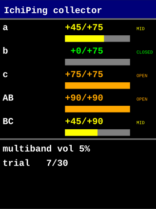

# 09_collector — PC 制御ラベル付きデータ採取

v0.5 NN 訓練用のデータ採取ステーション。08 の SAI 全二重 + 02 の PCA9685 サーボ + 03 の ILI9341 TFT を統合し、OpenSDA UART 1 本で **PC ↔ MCU 双方向プロトコル**を回す。サーボ座標系・校正運用の正式仕様は [docs/servo_coords.md](../../../docs/servo_coords.md) を参照。

## アーキテクチャ

```
[PC: collector_client.py]                       [MCU: 09_collector]
  PING / GET / SET / SERVO / RUN / STOP   →  ichp_cmd_lbuf_feed
                                                       │
                                                       ▼
  OK ... / ERR ... / INFO ... 1 行         ←  uart_write_line
                                                       │
  ICHP audio frame ×repeats（servo_deg[5] = 実角）←  send_frame
```

ASCII 行と ICHP バイナリは同一 UART に多重化。PC は `ICHP` magic で境界判定。

## コマンド一覧（[shared/include/ichp_cmd.h](../../shared/include/ichp_cmd.h) 参照）

| 種別 | コマンド | 例 | 効果 |
|---|---|---|---|
| 診断 | `PING` | `PING` | `OK PONG <build>` 応答 |
| 取得 | `GET CONFIG` / `GET HOME` / `GET OPEN` / `GET PINS` | `GET HOME` | 現状を OK 行で返す |
| 設定 | `SET VOLUME <0..100>` | `SET VOLUME 5` | TX ソフト音量 |
| パターン | `PAT INFO` / `PAT SELECT <idx>` / `EMIT <idx>` | `PAT SELECT 1` | パターンライブラリ（[`pc/patterns.yaml`](../../../pc/patterns.yaml) で定義）から選択／テスト発音。詳細は §パターン |
| 設定 | `SET REPEATS <N>` | `SET REPEATS 30` | RUN 時の試行回数 |
| 設定 | `SET PIN <servo> <deg>` | `SET PIN AB 0` | 当該扉/窓を RUN 時に固定 |
| 設定 | `CLEAR PIN <servo>` / `CLEAR PINS` | `CLEAR PIN AB` | pin 解除 |
| 校正 | `SET HOME <servo> <deg>` | `SET HOME a 12` | home（閉位置, mechanical）を RAM 更新 |
| 校正 | `SET OPEN <servo> <deg>` | `SET OPEN a 87` | open（全開位置, mechanical）を RAM 更新 |
| 校正 | `SAVE HOME` | `SAVE HOME` | home / open を MCXN947 PFlash 末尾セクタへ書込（boot 時に自動復元） |
| マニュアル | `SERVO <servo> <deg>` | `SERVO a 45` | 1 ch を動かす → 移動距離分待機（300 ms + 5 ms/deg、最長 1.5 s）→ 自動で当該 ch OFF（hum 防止） |
| マニュアル | `SERVO <servo> OFF` | `SERVO AB OFF` | 1 ch のみ即 PWM 停止（脱力） |
| マニュアル | `SERVO ALL OFF` | `SERVO ALL OFF` | 全 PWM 即停止 |
| マニュアル | `OPEN <servo>` | `OPEN a` | `open_deg` に動かす → 移動距離分待機 → 自動で当該 ch OFF |
| マニュアル | `CLOSE <servo>` | `CLOSE AB` | `home_deg` に動かす → 移動距離分待機 → 自動で当該 ch OFF |
| マニュアル | `OPEN ALL` | `OPEN ALL` | **a→b→c→AB→BC** を 1 ch ずつ `open_deg` に動かす（窓 → 扉、各 ch 距離分待機 + 自動 OFF）。フル 180° 移動なら合計 ~4.5 s、変化なしなら即終了 |
| マニュアル | `CLOSE ALL` | `CLOSE ALL` | **BC→AB→c→b→a** を 1 ch ずつ `home_deg` に動かす（扉 → 窓、airlock、各 ch 距離分待機 + 自動 OFF） |
| 実行 | `RUN` | `RUN` | repeats 回データ採取 |
| 中断 | `STOP` | `STOP` | 次フレーム境界で中断 |
| パターン | `PAT NOISE <name> <dur_ms> [vol_pct] [shape]` | `PAT NOISE wn3s 3000 30 0` | ホワイトノイズパターンを追加（shape: 0=PRBS, 1=uniform。vol_pct 既定 30、shape 既定 0=PRBS） |
| EQ | `EQ ENABLE` / `EQ DISABLE` | `EQ DISABLE` | スピーカ EQ をオン/オフ切替。**起動時は DISABLE がデフォルト**。発信は全パターン（PULSE/SWEEP/NOISE）共通で EQ を通る |
| EQ | `EQ RESET` | `EQ RESET` | 8 段すべてをハードコード defaults（初版は identity）に戻す。enable 状態は変えない |
| EQ | `EQ SET <stage> <b0> <b1> <b2> <a1> <a2>` | `EQ SET 0 1.05 -2.00 0.95 -1.98 0.99` | 1 段の biquad 係数（DF1, a0=1 正規化、float）を上書き。stage は 0..7 |
| EQ | `EQ GET` | `EQ GET` | 全 8 段の係数を OK 行 ×8 で返す |
| EQ | `EQ STATE` | `EQ STATE` | `OK EQ state=ENABLED stages=8` 等で現状を返す |

servo 名: `a` / `b` / `c` / `AB` / `BC`（大文字小文字無視）。角度引数はすべて **mechanical_deg**（PCA9685 への生 PWM 角、レンジ **0..180**）。0..180° が **0.5..2.7 ms パルス幅（duty 2.5..13.5 %）** に線形マップ — 上限は SG90 データシート（2.5 ms）より少し広げて実機メカ端到達を優先。`SERVO` / `SET HOME` / `SET OPEN` / `SET PIN` 全部 mechanical 系。表示用の logical 系 (閉=0, 開=+, 全 ch max 180) は [docs/servo_coords.md](../../../docs/servo_coords.md) を参照。

## 動作シーケンス

```
boot
 └ servo_config_init → drive servos to home_deg → wait full-swing settle (~1.2 s, worst case 180° from arbitrary boot) → release PWM (idle, silent) → READY
loop:
 └ poll UART RX
    ├ line complete → parse → dispatch → respond
    │   └ on RUN:
    │       for i in 0..repeats-1:
    │         build trial pattern (SET PIN values where present;
    │           otherwise s_state.current_deg, i.e. the last
    │           SERVO/OPEN/CLOSE/CLOSE_ALL/OPEN_ALL position —
    │           no randomisation, the PC client owns state)
    │         drive servos, settle 400 ms
    │         render selected pattern from pattern_lib (cached at start)
    │         play_and_capture (full-duplex SAI1, n_samples per pattern)
    │         send ICHP frame (servo_deg[] = actual angles applied)
    │         poll for STOP between trials
    └ idle → __WFI
```

## PC 側ツールの立ち上げ — [`pc/collector_client.py`](../../../pc/collector_client.py)

### 1. 環境セットアップ（一度だけ）

uv 推奨（pyserial 1 つだけで動く軽量ツールなので extras なし `uv sync` で十分）:

```powershell
# uv 初導入 (1 回だけ)
irm https://astral.sh/uv/install.ps1 | iex

cd pc
uv sync                    # pyserial だけ取得、~3 秒
```

conda 派の場合は `conda env create -f environment.yml` でも OK。詳細は [pc/README.md](../../../pc/README.md) 参照。

### 2. COM ポート確認

Windows: デバイスマネージャ → 「ポート (COM と LPT)」 → FRDM-MCXN947 OpenSDA の COM 番号を控える（例 `COM7`）。複数 USB シリアル機器がある場合は、ボードを抜き差しして消える / 出てくるポートが目印。

### 3. 起動 — REPL モード

```powershell
cd pc
uv run python collector_client.py --port COM7 --out ../captures
```

起動成功時:

```
connected COM7 @ 921600 bps, output -> ../captures
  < INFO IchiPing 09_collector ready
  < INFO build May 16 2026 18:42:11
  < INFO send PING to test, GET CONFIG for state, RUN to collect

Commands forwarded to the MCU (case-insensitive verb):
  PING
  GET CONFIG / GET HOME / GET OPEN / GET PINS
  ...
>
```

`>` プロンプトでコマンドを打つと **そのまま 09_collector ファームに送信**され、MCU からの応答（`OK ...` / `ERR ...` / `INFO ...`）が `  < ...` で表示される。バイナリ ICHP フレームが流れてくれば自動でデマルチプレクスして `captures/<label>/frame_NNNNNN.wav` に保存。

### 4. 基本コマンド例

**疎通確認**:

```
> PING
  < OK PONG May 17 2026 10:25:09
> GET CONFIG
  < OK CONFIG rate=16000 max_window=32000 pattern=multiband_default sel_idx=0 count=4 volume=5 repeats=30
> GET HOME
  < OK HOME a=0 b=0 c=0 AB=0 BC=0
```

**サーボ校正（ホーン取付調整時）**:

```
> SERVO a 0           # マニュアル角度指定
  < OK SERVO a deg=0
> SERVO a 12
  < OK SERVO a deg=12   # 「閉」になる角度を目視で探す
> SET HOME a 12       # その値を home (閉) として焼く
  < OK HOME a 12
> SERVO a 87          # 「開」になる角度を探す
> SET OPEN a 87
  < OK OPEN a 87
> GET HOME            # 5 ch 分の home 一覧
  < OK HOME a=12 b=0 c=0 AB=0 BC=0
```

> 角度は整数のみ表示（newlib-nano の既定で `%f` がリンクされないため整数化）。サーボ精度として 1° で十分。サブ度精度が必要になったら CMake LD に `-u _printf_float` 追加で復活可。

詳細手順は [docs/servo_coords.md §3](../../../docs/servo_coords.md)。

**ラベルを切替えてデータ採取**:

```
> :label door_closed         # PC 側ローカルコマンド (MCU に届かない)
  label set to 'door_closed' (next frames -> <out>/door_closed/)
> SET PIN AB 0           # AB を「閉」固定
  < OK PIN AB 0
> SET PIN BC 0
  < OK PIN BC 0
> SET REPEATS 30
  < OK REPEATS 30
> RUN
  < OK RUN started repeats=30 pattern=multiband_default samples=28800
  > saved frame_000000.wav (seq=1)
  > saved frame_000001.wav (seq=2)
  ...
  < OK RUN done frames=30
```

30 試行ぶん `captures/door_closed/frame_000000.wav` ... `frame_000029.wav` と `labels.csv` が保存される。

### 5. 起動 — プラン実行モード（推奨, 学習データ採取の本番）

JSON プランを書いて 1 コマンドで複数条件を順次採取:

```json
[
  {"label": "door_closed", "pins": {"AB": 0,  "BC": 0},  "repeats": 30},
  {"label": "door_half",   "pins": {"AB": 45, "BC": 45}, "repeats": 30},
  {"label": "door_open",   "pins": {"AB": 90, "BC": 90}, "repeats": 30},
  {"label": "amb_silence", "pins": {}, "pattern": "silence_2s", "repeats": 10}
]
```

```powershell
uv run python collector_client.py --port COM7 --plan plan.json --out ../captures
```

各 step ごとに `CLEAR PINS` → `SET PIN ...` → `SET REPEATS N` → `RUN` を自動発行。所要時間は約 `repeats × 3 秒 + 設定オーバーヘッド数秒` × step 数。上記 4 step / 計 100 試行で約 6 分。

### 6. ローカルコマンド（`:` で始まる、MCU には届かない）

| コマンド | 効果 |
|---|---|
| `:label <name>` | 以降のフレーム保存先を `captures/<name>/` に切替 |
| `:help` | コマンド一覧表示 |
| `:quit` / `:exit` | 切断して終了 |

### 7. トラブルシュート

| 症状 | 対処 |
|---|---|
| `FAIL opening COM7` | 別ターミナル（TeraTerm 等）が掴んでいる。閉じる |
| `< INFO IchiPing 09_collector ready` が来ない | ファームが起動していない / COM 番号間違い / ボーレート不一致（921600 固定）|
| `OK RUN started` 後にフレームが来ない | I²C 不通でサーボ駆動失敗 → `SERVO a 45` 単体で動作確認、デバッグ |
| `! frame seq=N CRC BAD` 頻発 | UART バッファ溢れ。USB ケーブル変更、PC 側 USB ハブ介在を外す |
| サーボが微動するだけ | 外部 5V レール不足 → 1000 µF 電解 + 安定 5V 給電確認 |

## 使い方（コマンドリファレンス）

### インタラクティブ

```powershell
cd pc
python collector_client.py --port COM7 --out ../captures
> PING
OK PONG May 17 2026 10:25:09
> GET HOME
OK HOME a=0 b=0 c=0 AB=0 BC=0
> SERVO a 45        # マニュアル動作確認（ホーン取付調整用）
> SET HOME a 12     # 「閉」位置を 12° に校正
> CLEAR PINS
> SET PIN AB 0        # AB だけ固定、ほかはランダム
> SET REPEATS 30
> RUN
INFO label=...
[bin frame 1] [bin frame 2] ...
OK RUN done frames=30
```

### スクリプト（条件×繰返しを一発）

```powershell
python collector_client.py --port COM7 --plan plan.json --out ../captures
```

`plan.json` 例（pin 構成で 4 種類の条件を順次採取）:

```json
[
  {"label": "door_closed", "pins": {"AB": 0,  "BC": 0},  "repeats": 30},
  {"label": "door_half",   "pins": {"AB": 45, "BC": 45}, "repeats": 30},
  {"label": "door_open",   "pins": {"AB": 90, "BC": 90}, "repeats": 30},
  {"label": "amb_silence", "pins": {}, "pattern": "silence_2s", "repeats": 10}
]
```

各 step ごとに `CLEAR PINS` → `SET PIN ...` → `SET REPEATS N` → `PAT SELECT <idx>` → `INFO label=<label>` ASCII 注記 → `RUN`。フレーム受信側で「直前の `label=` 行」を取って `captures/<label>/frame_NNNNNN.wav` ＋ `labels.csv` の 1 行を追加する。

## ICHP フレーム内 `servo_deg[5]` の意味

このプロジェクトでは **当該試行で実際にサーボに送った角度（絶対）**。`home_deg` でも `open_deg` でもなく、PCA9685 に書き込んだ値そのもの。pin 指定があった ch は pin の値、無指定 ch はランダム結果。

ラベル文字列は **フレーム外**、各 RUN の前に `INFO label=...` で送る。PC 側は ASCII 行 / バイナリの逐次到着順を保つことで対応付け。

## サーボ校正（home / open 位置決定）の運用

詳細手順は [docs/servo_coords.md §3 校正手順](../../../docs/servo_coords.md) に集約。要点だけ:

1. `SERVO a <deg>` で 1 ch ずつ動かして「閉」位置と「全開」位置を探る
2. `SET HOME a 12` / `SET OPEN a 87` で RAM に焼き付け（窓は `open - home = 75°`、扉は `90°` が目標）
3. 5 ch ぶん繰り返し、`GET HOME` / `GET OPEN` で確認
4. **`SAVE HOME` で MCXN947 PFlash 末尾セクタ（0x001FE000, 1 page = 128 B）に書込**。`OK HOME saved` が返れば成功。エラー時は `ERR SAVE_HOME code=<n>` ([servo_config.h](../../shared/include/servo_config.h) のコード一覧参照)
5. 以降は boot 時に flash から自動復元（CRC-16 検証 NG ならコンパイル時 `SERVO_CONFIG_DEFAULTS` にフォールバック）

## ディスプレイ（ILI9341 240×320）

09_collector は TFT を持っていれば自動で 5 サーボのリアルタイム状態パネルを描画する。パネル不在でもファームはヘッドレス動作（display 関数は no-op）。



- 表示角度は **logical_deg**（閉 = 0, 開方向 = +）。mechanical_deg からの変換は `servo_config_to_logical()` 経由
- 色: 緑 = CLOSED（logical ≤ 3°）／橙 = OPEN（logical ≥ 95% × max）／黄 = MID
- 各 SERVO / RUN コマンドで即座に再描画

配線は [03_ili9341_test](../03_ili9341_test/README.md) と同一（LPSPI1 + A2/A3/A4/A5 GPIO）。本パネルの詳細仕様は [docs/servo_coords.md §4 ディスプレイ表示](../../../docs/servo_coords.md)。

## パターンライブラリ

発振波形は MCU 内にハードコードせず、PC 側 [`pc/patterns.yaml`](../../../pc/patterns.yaml) が正本。`collector_client.py` 起動時に MCU の RAM ライブラリへ全パターンを push し、`PAT SELECT <idx>` で切替、`RUN` または `EMIT <idx>` で発音。

### YAML フォーマット

2 種類:

**pulse** — 連続トーンのリスト。録音時間 = Σ(on+off) × repeat:

```yaml
- name: multiband_default
  type: pulse
  repeat: 6
  tones:
    - {freq_hz: 2000, on_ms: 1, off_ms: 49}
    - {freq_hz: 3000, on_ms: 1, off_ms: 49}
    # ...
```

**sweep** — リニア chirp + 静音。録音時間 = sweep_ms + silence_ms:

```yaml
- name: chirp_200_6k
  type: sweep
  start_hz: 200
  end_hz: 6000
  sweep_ms: 2000
  silence_ms: 0
```

無音は `freq_hz: 0` の 1-tone pulse で表現（特別な type 不要）:

```yaml
- name: silence_2s
  type: pulse
  tones:
    - {freq_hz: 0, on_ms: 0, off_ms: 2000}
```

上限（[`pattern_lib.h`](../../shared/include/pattern_lib.h)）: ライブラリ 16 パターン、pulse 64 tones、合計 2000 ms。

### REPL での操作

```
> :patterns                    # PC キャッシュ表示
  [0] pulse  tones=6 repeat=6 dur=1800ms  multiband_default
  [1] sweep  200..6000Hz sweep=2000ms silence=0ms dur=2000ms  chirp_200_6k
  [2] pulse  tones=1 repeat=1 dur=2000ms  silence_2s
  [3] pulse  tones=2 repeat=1 dur=400ms   dual_low_high

> EMIT 3                       # パターン 3 を 1 回テスト発音
  < OK EMIT idx=3 name=dual_low_high samples=6400

> :select multiband_default    # RUN で使うパターンを切替 (名前→idx 解決はローカル)
  -> PAT SELECT 0  (multiband_default)
  < OK PAT select idx=0 name=multiband_default

> RUN                          # 選択中のパターンで採取
  < OK RUN started repeats=30 pattern=multiband_default samples=28800
  ...
```

`EMIT <idx>` は MCU 側コマンド（[`ichp_cmd.h`](../../shared/include/ichp_cmd.h) の `ICHP_CMD_EMIT`）。PC 側 REPL は `EMIT N` を検知すると再生終了 (OK EMIT) まで次の入力をブロックし、再生中に次のコマンドを送って MCU の UART RX FIFO を取りこぼさせる事故を防ぎます。

### MCU 側コマンド（直叩き用）

| コマンド | 機能 |
|---|---|
| `PAT INFO` | ライブラリ内容を一覧表示 |
| `PAT SELECT <idx>` | RUN で使うパターン選択 |
| `EMIT <idx>` | パターン 1 回発音（録音なし、サーボ動かさず）|
| `PAT CLEAR` | ライブラリ全消去 |
| `PAT PULSE BEGIN <name>` / `PAT TONE <hz> <on_ms> <off_ms>` / `PAT PULSE END <repeat>` | pulse 追加（手動ロード用） |
| `PAT SWEEP <name> <start_hz> <end_hz> <sweep_ms> <silence_ms>` | sweep 追加（1コマンド完結） |

通常は YAML 経由でロードするので、`PAT PULSE *` / `PAT SWEEP` を直接打つ必要はないはず。

### YAML 編集後の反映

```
> :reload                      # patterns.yaml を再読込 + MCU に再 push
  patterns.yaml reloaded (4 entries); pushing to MCU...
  > PAT CLEAR
  > PAT PULSE BEGIN multiband_default
  ...
  reload complete. use :patterns to verify.
```

ボード RESET 不要。新しい name や型変更がそのまま使える。

### プラン実行モードでのパターン指定

`plan.json` の各 step に `pattern: <name>` を入れると、step ごとに自動切替:

```json
[
  {"label": "door_closed", "pins": {"AB": 0, "BC": 0}, "pattern": "multiband_default", "repeats": 30},
  {"label": "door_chirp",  "pins": {"AB": 0, "BC": 0}, "pattern": "chirp_200_6k",      "repeats": 30},
  {"label": "amb_silence", "pins": {},                  "pattern": "silence_2s",        "repeats": 10}
]
```

省略すると前 step のパターン継続（または起動時の auto-select pattern 0）。

## ホワイトノイズ + スピーカ EQ

走査音考察 [docs/probe_sound.html](../../../docs/probe_sound.html) §2.7 ＋ §3.A に対応する実装。

### ホワイトノイズパターン

`PATTERN_KIND_NOISE` を pattern_lib に追加。`PAT NOISE` コマンドで登録、`EMIT` / `RUN` で他のパターン同様に使用可能。

```
> PAT NOISE wn3s 3000 30 0
OK PAT noise name=wn3s dur=3000 vol=30 shape=0
> PAT SELECT 0       # 直前に登録したインデックスを選ぶ
OK PAT select idx=0 name=wn3s
> EMIT 0
```

shape: `0` = PRBS (±1 二値、クレストファクタ 0 dB)、`1` = uniform int16 (~4.8 dB)。
PRBS が SPK 出力を最も効率的に使えるため推奨。

### スピーカ EQ (8 段 biquad cascade)

`pattern_render()` 直後の signal-path に挿入される **デフォルト OFF**（identity）の補正フィルタ。
EQ がオフのときは PCM バッファに 1 命令も触れないので、従来の発信動作はビット単位で変わらない。

#### 起動時の状態

```
INFO BOOT spk_eq ready (disabled, identity defaults)
```

EQ を使わない運用は何もコマンドを送らなければ従来通りの挙動。

#### キャリブレーション → EQ 計算 → 適用 のワークフロー

1. **キャリブレーション計測**: SPK と mic をハウスから外し、布団を被せて準無響条件（[docs/probe_sound.html](../../../docs/probe_sound.html) §3.A.2）にセット
2. **EQ を必ず OFF にして**ホワイトノイズを撃つ
   ```
   > EQ DISABLE
   OK EQ disabled
   > PAT NOISE cal 3000 30 0
   OK PAT noise name=cal dur=3000 vol=30 shape=0
   > PAT SELECT <idx>
   > RUN                  # 1 frame だけでも OK
   ```
3. **PC 側で EQ 設計**: 取得 WAV を Python (scipy.signal.iirdesign / bilinear) で解析し、
   8 段 biquad の係数（b0, b1, b2, a1, a2 × 8 stage = 40 個）を生成
4. **EQ 係数を送信**:
   ```
   > EQ SET 0 1.05 -2.00 0.95 -1.98 0.99
   OK EQ set stage=0
   > EQ SET 1 ...
   ... (8 段すべて)
   > EQ ENABLE
   OK EQ enabled
   ```
5. **本計測**: 機材をハウスに戻し、EQ ENABLE のままで通常の RUN / EMIT。全パターン（PULSE / SWEEP / NOISE）に EQ が適用される
6. **EQ を一時的に外したい場合**: `EQ DISABLE` で OFF（係数は保持されたまま）、再度 `EQ ENABLE` で復帰
7. **デフォルトに戻したい場合**: `EQ RESET`（係数を identity に戻す、enable 状態は変えない）

#### CPU コスト

16 kHz × 8 段 × ~10 float op = 約 1.3 M op/s、Cortex-M33 + FPU（単サイクル FMA）で総計の 1 % 未満。
通常の `pattern_render` + `play_and_capture` ループに対して無視できる。

#### 注意事項

- **キャリブレーション中は必ず `EQ DISABLE`** にすること。EQ ON のまま測ると「SPK + EQ + mic」の合成応答を測ることになり、EQ 設計のループが破綻する
- EQ がフィルタを適用中の最初の数 ms は biquad の過渡応答が出る → PC 側解析で **先頭 10 ms をスキップ**するのが安全
- 8 段すべて identity（デフォルト）なら EQ ENABLE しても発信は変わらない（ただし数値上わずかな float→int16 量子化誤差は乗る）
- 係数の安定性チェックは PC 側責任: `|a1| < 2` かつ `|a2| < 1` 程度を満たさないと filter が発散する

## 配線

[08_mic_speaker_test](../08_mic_speaker_test/) の和集合 + [02_servo_test](../02_servo_test/) の I²C:

| 信号 | ピン | 備考 |
|---|---|---|
| SAI1 BCLK / FS / TXD / RXD | J1.1 / J1.11 / J1.5 / J1.15 | 08 と同じ（INMP441 + MAX98357A） |
| LPI2C2 SDA / SCL | D18 (P4_0) / D19 (P4_1) | 02 と同じ（PCA9685） |
| OpenSDA UART | LPUART4 | 921600 bps 双方向 |
| サーボ PWM | PCA9685 ch 0..4 | a/b/c, AB/BC |
| サーボ 5V | 外部 5V レール | MAX98357A と共通、1000 µF 電解必須 |
| ILI9341 TFT | LPSPI1 + A2/A3/A4/A5 GPIO | 03_ili9341_test と同じ。未接続でもファームは動作 |

## ビルド手順（MCUXpresso for VS Code）

このプロジェクトは設定一式（`frdmmcxn947_cm33_core0/`、`CMakeLists.txt`、`prj.conf` 等）を完備しているので、雛形コピーは不要:

1. **VS Code → MCUXpresso → Import Project From Folder** → `firmware/projects/09_collector/`
2. **ビルド → OpenSDA で書込**
3. **`pc/collector_client.py --port COMx --out ../captures` で接続** → `PING` 応答確認

### サーボバックエンド切替

`CMakeLists.txt` の `mcux_add_configuration` で選択:

```cmake
mcux_add_configuration(
    CC "-DSERVO_BACKEND_PCA9685"
)
```

既定は **PCA9685**（NXP, 16ch, I²C 0x40）。実機 LU9685 で約 30° の往復スイングが出て V+ バルクキャパシタを足しても解消しなかったため、本プロジェクトでは PCA9685 をデフォルトに採用。**LU9685**（20ch, 0x1F）に戻すなら `-DSERVO_BACKEND_LU9685_I2C` に変更してリビルド。両バックエンドの `.c` を CMake に含めているのでマクロ差替えだけで OK。

> 起動時の `INFO BOOT I2C scan: 0xXX` 行で実際に ACK したアドレスが分かるので、ジャンパ設定と firmware の `PCA9685_DEFAULT_ADDR` / `LU9685_DEFAULT_ADDR` の整合は boot ログで確認可。

## 既知の制約 / TODO

- **フラッシュ予約領域は単一スロット**（last sector of m_flash1, 0x001FE000）。摩耗均等化（wear levelling）は無し。SG90 校正用途では SAVE HOME を 1 万回叩いても寿命に届かないため許容
- **サーボ移動とキャプチャは直列**。1 試行 = 0.4 s 待ち + 2 s キャプチャ + 0.56 s UART 送信 = **3 秒/フレーム**。30 フレーム = 1.5 分。USB CDC（05 ベース）に乗り換えれば UART 送信 0.1 s に短縮可
- **ラベル対応付けがシーケンシャル前提**。並列 RUN 不可（並列にする場合はラベル ID をフレーム内に埋める拡張が必要）
- **ランダム化は二値選択（home / open のいずれか）**。連続角度ランダム化が必要なら `build_trial_pattern` を改修
- **STOP は試行間境界でのみ反映**。1 試行 3 秒のラグを許容する設計
